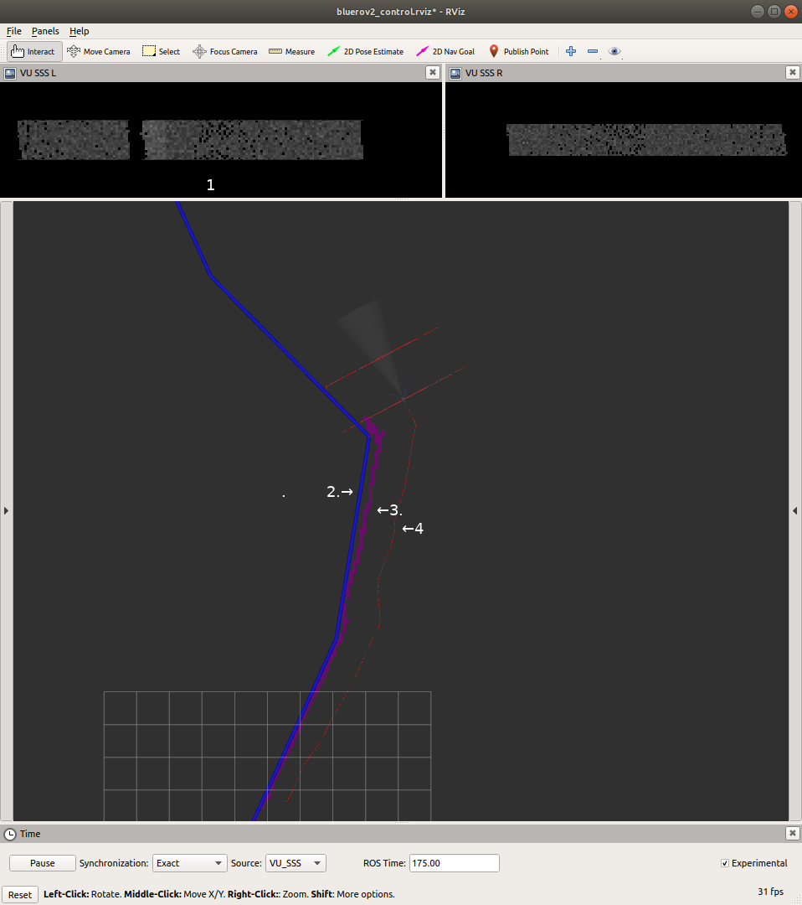

**[Home](https://AbLECPS.github.io) >> CP1**

# Challenge Problem 1 - Pipe tracking

CP1 includes scenarios with pipeline following and obstacle avoidance.

- 1: RAW Side Scan Sonar image (Left & Right)
- 2: Pipeline
- 3: Estimated pipeline positions
- 4: UUV path

## CP1_00

This is a general scenario involves pipe tracking and obstacle avoidance. The UUV attempts to avoid static and dynamic obstacles while tracking the pipe. The user may tweak the following tables related to CP1

  - Pipe : For pipeline generation details
  - Obstacles: For static and dynamic obstacles. By default only static obstacle generation is enabled.

## CP1_01_geofence_rth
This simulation presents a pipe tracking scenario with Geofence failsafe and Return To Home (RTH).

When the UUV reaches maximum distance from Home Position (Geofence = 50m), the UUV activates Geofence failsafe and command Return To Home (RTH).
When UUV reaches home position, it emerges to the surface in a helix.

Parameters of interest include:

 - Autonomy/ batt_charge [0.0 to 1.0]
 - Autonomy/ geofence_threshold
 - Autonomy/ failsafe_rth_enable [true/false]
 - Obstacles/ enable_obstacles [true/false]

## CP1_02_obstacles
This simulation presents a pipe tracking scenario, with random obstacles.

Parameters of interest include:

 - Autonomy/ batt_charge [0.0 to 1.0]
 - Autonomy/ failsafe_rth_enable [true/false]
 - Obstacles/ enable_obstacles [true/false]

## CP1_03_batt_low
This simulation presents a pipe tracking scenario, with low (20%) battery level at the beginning, without Return to Home function. This means UUV is executing the mission as long as it can, before battery gets critically low (15% for this example).

When the battery level reaches critically low threshold, the UUV is commanded to surface. 
The UUV emerges to the surface in a helix. 

Parameters of interest include:

 - Autonomy/ batt_charge [0.0 to 1.0]
 - Autonomy/ failsafe_rth_enable [true/false]
 - Obstacles/ enable_obstacles [true/false]
 - Autonomy/failsafe_battery_low_threshold [0.1 to 0.2]

