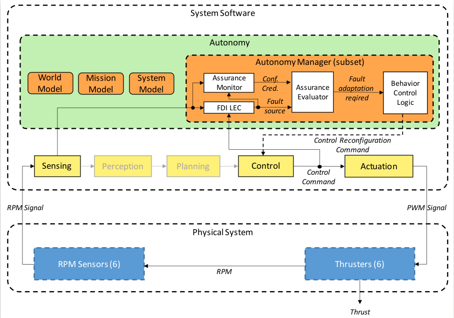

**[Home](https://AbLECPS.github.io) >> CP2**

# Challenge Problem 2 - Thruster degradation

This simulation presents a pipe tracking scenario, with thruster degradation with or without static obstacles. By default it is #1 thruster, efficiency drops to 79% at t=50s.

Fault Detection, Isolation, Reallocation (FDIR - DD_LEC) system is active, detects degradation under 1-5 seconds. After detection FDIR reallocates thrusters to balance torque loss and maintain control for pipe tracking mission.

For detailed information about the BlueROV2 Behaviour Tree based autonomy and the fault detection topic please check our paper: [https://www.mdpi.com/1424-8220/21/18/6089](https://www.mdpi.com/1424-8220/21/18/6089)

Parameters of interest include:

 - Degradation/ thruster_motor_failure [true/false]
 - Degradation/ enable_fault_detection [true/false] (this controls reallocation - detection itself is actice all the time)
 - thruster_id [0 to 5] : ID of the degraded thruste
 - thruster_thrust_force_efficiency [0.0 to 1.0]
 - thurster_motor_fail_starting_time [1 to end of simulation]
 - enable_obstacles [true/false]

