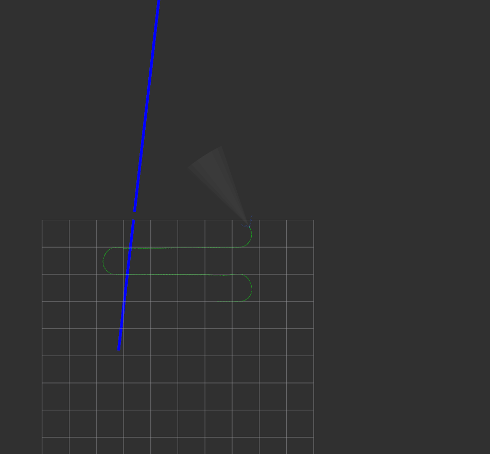

**[Home](https://AbLECPS.github.io) >> Challenge Problem 4**

# Challenge Problem 4 - Waypoint Following

CP4 includes scenarios with waypoint following and obstacle avoidance.

## CP4_00
This simulation presents a waypoint following scenario. Waypoints are defined in the mission file:

 - mission_file [mission_04.yaml]

## CP4_01 (obstacle on waypoint)
This simulation presents a waypoint following scenario, where a static obstacle is detected close to waypoint #3. UUV alters the waypoint - moves it forward towards the next waypoint. When it is closer to a given threshold to the next waypoint, UUV skips the already altered one.

The Mission/ mission_file parameter controls the mission file used in the simulation. This file includes the waypoints for the UUV to reach.

  - enable_obstacles [true/false]

