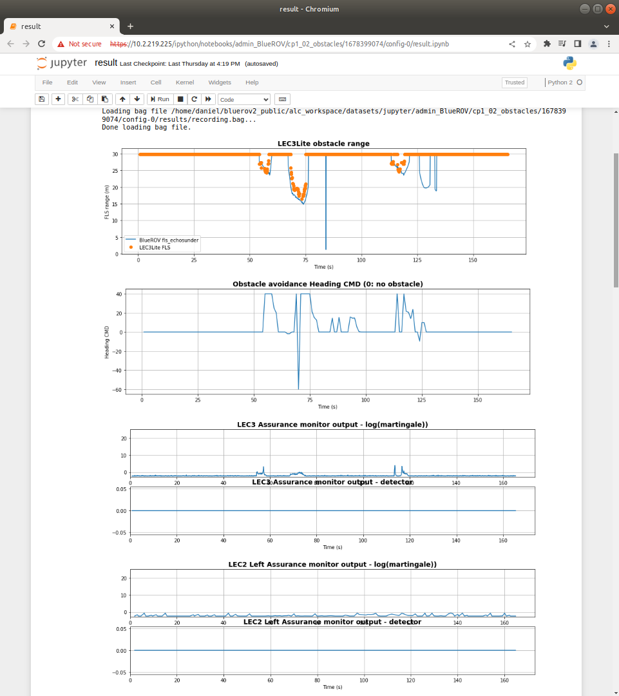
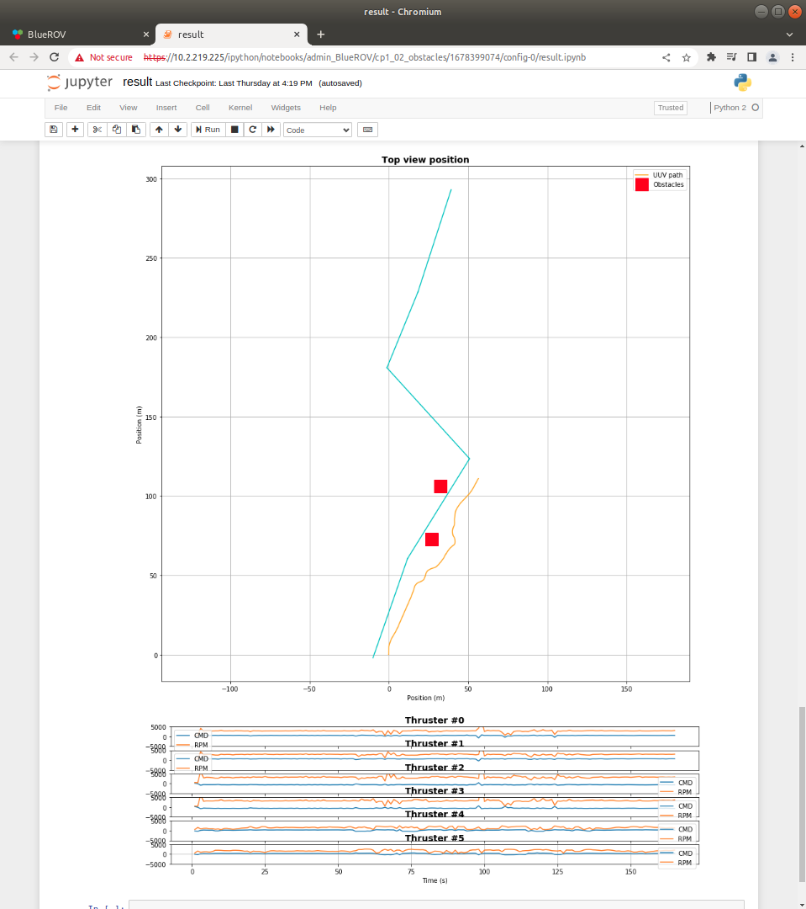
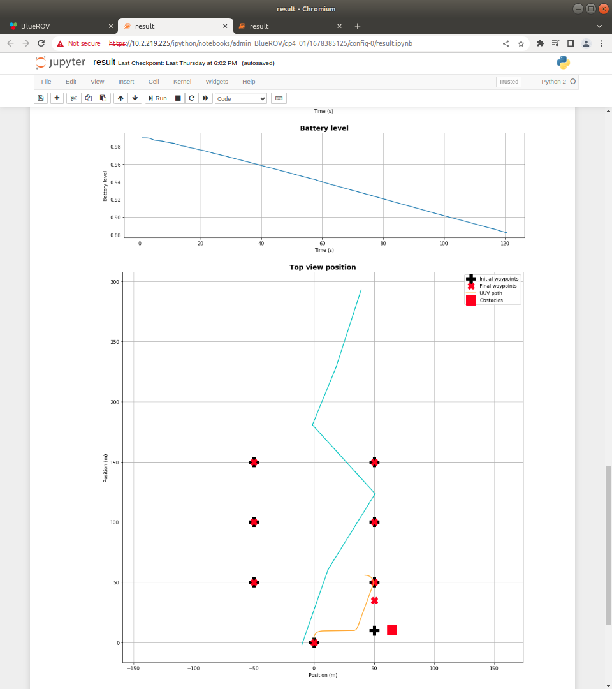

**[Home](https://AbLECPS.github.io) >> Results & post process**

# Results and post process

After successfully executing an Activity with the UUV, a results plot can be computed with a post process function from the collected ROS .bag files.

The top part of these results shows plots from FLS LEC3 and LEC3 & LEC2 Assurance Monitors:

---

The bottom part shows the mission path in a local coordinate system (top view) with the pipe, UUV path and obstacles:

---

If the mission was Waypoint Following the plot shows the initial and final (altered) waypoints as well:

