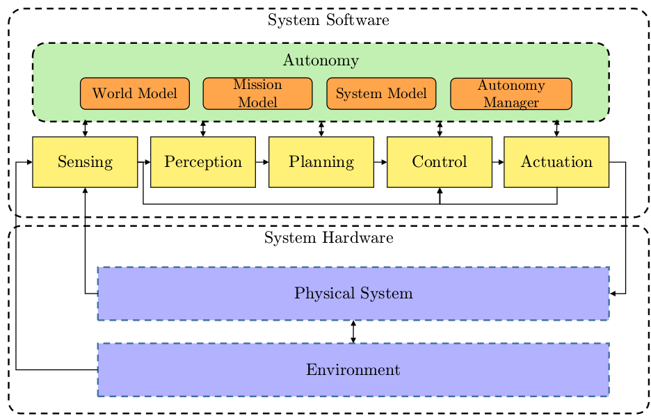

**[Home](https://AbLECPS.github.io) >> UUV Activity definitions**

## UUV Example: 

This toolchain is capable of simulating an autonomous BlueROV2 UUV in an underwater environment, also the runtime code is prepared to operate on the real ROV hardware as well - what is not part of the release yet.

The software is based on [ROS Melodic](http://wiki.ros.org/melodic) and [Gazebo](https://gazebosim.org/home), an open source 3D robotics simulator.

The system is divided into hardware, which is the UUV itself including thrusters, sensors, etc., and software, which includes the autonomy engine and sensing-to-actuation pipeline. The autonomy engine consists of a world model which describes the UUV’s operating environment, including the occupancy-grid based pipeline map, obstacle map and other smaller maps for navigation and guidance. The mission model describes the UUV mission with the help of a mission file (what to execute) and a mission server (how and when to execute). The system model is a representation of the UUV operational state, either nominal or degraded, and any identified hazards such as low battery or obstacle detected. The autonomy manager implements the higher-level autonomy in the system, including the mission execution, and LEC-based fault-adaptive operation.

For detailed information about the BlueROV2 Behaviour Tree based autonomy and the fault detection topic please check our paper: [https://www.mdpi.com/1424-8220/21/18/6089](https://www.mdpi.com/1424-8220/21/18/6089)

